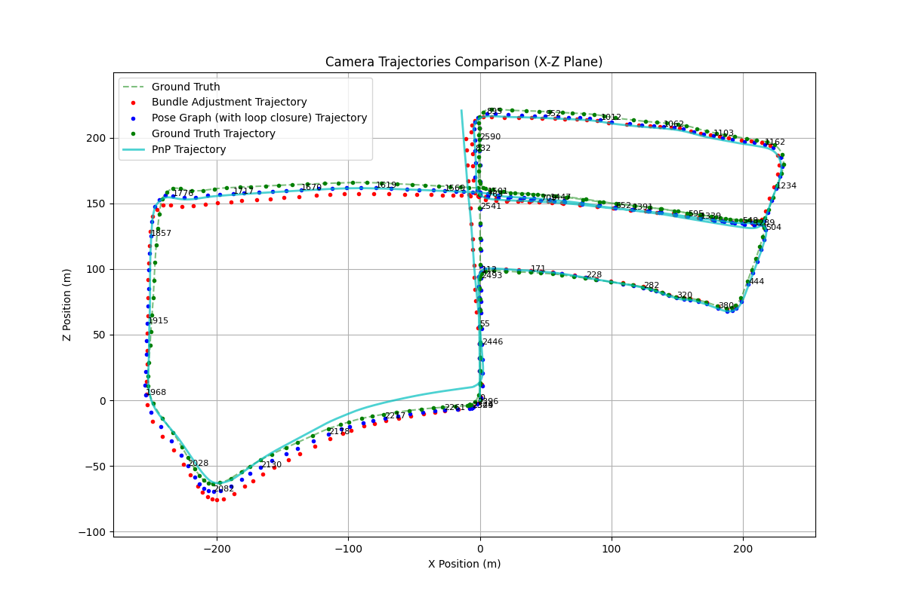
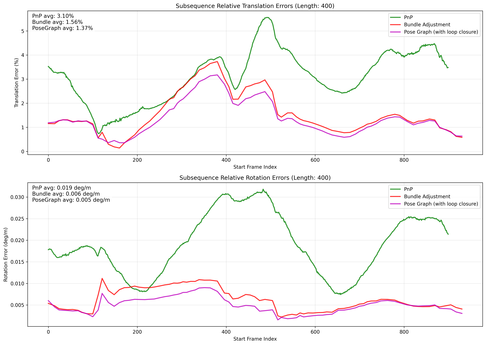
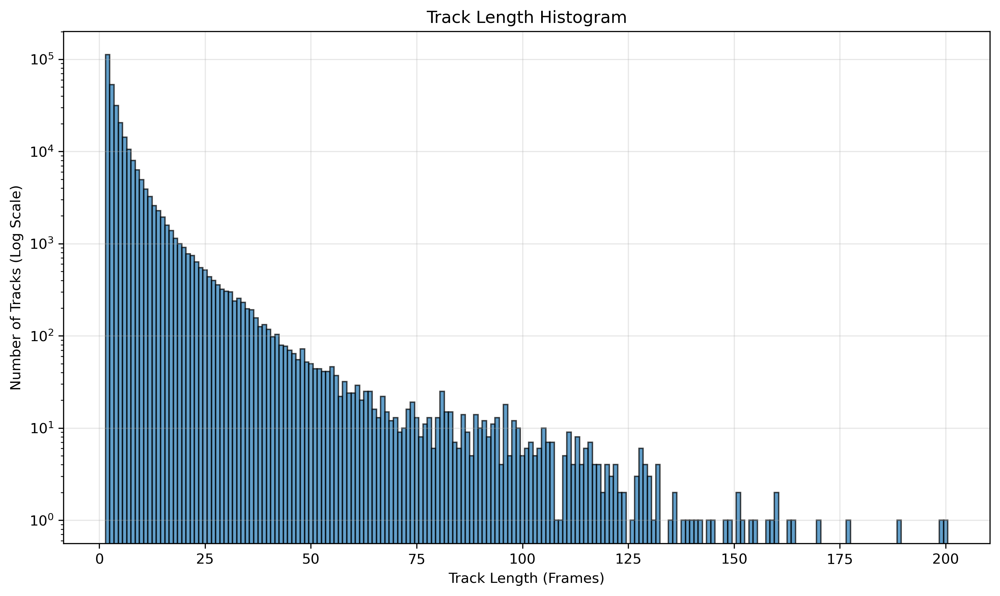

# Stereo Visual SLAM — KITTI Odometry Sequence 05


Stereo visual odometry with custom feature tracking and RANSAC-PnP orchestration, windowed bundle adjustment, and pose graph optimization using a ground-truth endpoint prior — developed on KITTI Sequence 05 over 2,600 frames.


*Historical camera trajectory comparison on KITTI Sequence 05 (X-Z plane).*

## Results

| Stage | Translation Error / 100 m |
|---|---|
| PnP (RANSAC) | 3.2 m |
| + Windowed Bundle Adjustment | 1.1 m |
| + Pose Graph + Ground-Truth Endpoint Prior | **0.9 m** |

These are historical reported results, not newly reproduced regression results.
The final stage uses ground truth as an estimation constraint. The metric
implementations retain their original sampling policies, including half-sequence
selection for subsequence plots; the summary figures' provenance still needs
verification against recovered checkpoints. The aggregation and frame coverage
behind this table have not been verified; it should not be read as a reproduced
standard KITTI benchmark.

| | |
|---|---|
|  |  |
| *Relative translation error for 400-frame subsequences — improvement visible at each stage* | *Track length histogram — most features tracked across 2–5 frames; long-lived tracks anchor BA windows* |

## Pipeline

1. **AKAZE stereo matching** — filter matches by vertical deviation < 2 px and positive disparity ≥ 2 px, then triangulate with OpenCV. The handwritten SVD triangulator is also retained for the coursework comparison.
2. **RANSAC-PnP motion estimation** — 4-point PnP with adaptive iteration count (99.9% confidence), refined on all inliers
3. **Windowed bundle adjustment** — GTSAM stereo factors in independently optimized windows, selected using feature count, track overlap, and translation criteria. Default endpoint separations are 5–20 frames; bounds are inclusive and the final window may be shorter.
4. **Pose graph with endpoint prior** — relative constraints from BA marginals and batch GTSAM Levenberg–Marquardt optimization. The historical classroom experiment supplies a tight prior from the final ground-truth pose; automatic visual loop detection is not implemented.

## Project Structure

- [Architecture and data flow](docs/architecture.md): module responsibilities, algorithm ownership, coordinate contracts and an interview reading order.
- [Coursework and report map](code/README.md): historical entry points, compatibility wrappers and remaining structural work.
- [Validation and correctness concerns](docs/validation.md): what has been tested, GTSAM-dependent checks and issues excluded from structural cleanup.
- [Migration status](docs/migration-status.md): reconciliation against the original phases and justified deferrals.
- [Artifact organization](docs/artifacts.md): runtime outputs, historical archives and distribution contents.

Reusable implementation lives in the flat, installable `kitti_slam/` package.
Internal imports are relative and never depend on coursework modules. `code/`
retains compatibility modules and historical artifacts. Exercise implementations
live in `coursework/`; report/experiment implementations live in `reports/`.
The compatibility modules alias the canonical modules, so there is one copy of
each implementation and its state.

| Path | Contents |
|---|---|
| `coursework/ex1.py` – `ex5.py`, `coursework/ex3code/` | Sequential exercises and timed demonstrations |
| `kitti_slam/pose_graph.py` | BA covariance/relative-pose extraction, explicit endpoint prior, batch pose graph optimization |
| `reports/pose_graph_loop_closure.py` | Historical report plots and persistence around the canonical pose graph |
| `kitti_slam/stereo.py` | Stereo filtering, OpenCV and handwritten SVD triangulation, four-view correspondences |
| `kitti_slam/motion.py` | Custom adaptive RANSAC, P3P hypothesis generation, iterative PnP refinement |
| `kitti_slam/supporters.py` | Four-view reprojection validation and supporter classification |
| `kitti_slam/tracking.py` | Canonical frame loop: stereo processing, motion estimation, track updates, and pose accumulation |
| `kitti_slam/bundle_adjustment.py` | BA graph construction and window optimization, returning checkpoint-compatible results |
| `kitti_slam/gtsam_geometry.py` | GTSAM calibration, pose conversion, and stereo backprojection |
| `kitti_slam/trajectory.py` | Trajectory extraction from window results, without plotting |
| `kitti_slam/evaluation/` | Shared trajectory/projection metrics, GT interpretation and report plots |
| `kitti_slam/checkpoints.py` | Trusted checkpoint loading, schema checks, atomic writes, upstream digest checks |
| `code/alg.py` | Compatibility exports for the original coursework imports |
| `kitti_slam/tracking_database.py` | `TrackingDB` — central data structure mapping frames ↔ tracks |
| `kitti_slam/window_selector.py` | Pluggable keyframe selection criteria for BA windows |
| `reports/` | Historical analysis scripts and plotting helpers |
| `code/`, `code/ex3code/`, `code/final/` | Legacy forwarding/import modules and artifact archives |
| `results/` | Key output plots (committed) |
| `artifacts/sequence-05/checkpoints/` | New pipeline outputs (ignored by Git) |
| `dataset/` | KITTI Sequence 05 — not included, see Setup |

## Setup

```bash
git clone https://github.com/ronketer/kitti-visual-slam
cd kitti-visual-slam
pip install -e ".[plotting]"
# On a platform with a compatible GTSAM package, add optimization support:
pip install -e ".[optimization]"
```

The base install (`pip install -e .`) needs only NumPy, OpenCV, and tqdm.
The `plotting` extra enables historical reports and the complete non-GTSAM test
suite. `requirements.txt` installs the editable package with that extra; it no
longer requires GTSAM on Windows. No solver substitute is installed.

`python -m kitti_slam`, the installed `kitti-slam` command, and the legacy
`python run_pipeline.py` entry point call the same pipeline. Editable installs
keep repository-relative dataset/artifact defaults even from another working
directory. For a wheel installation, set `KITTI_SLAM_ROOT` to your data/output
workspace; otherwise defaults are relative to the working directory at import
time. `ProjectPaths` still supports explicit dataset locations in Python.

The distribution includes the reusable package and a top-level
`tracking_database` compatibility module. Tracking classes keep their historical
pickle module names, so the package reads existing trusted checkpoints and new
checkpoints retain those class paths. Coursework scripts, dataset files, report
PDFs, and generated artifacts are not included in the wheel. The source
distribution includes coursework/report Python source, compatibility entry
points, tests and docs, with binary artifacts explicitly excluded.

**Dataset**: Download [KITTI Odometry Sequence 05](https://www.cvlibs.net/datasets/kitti/eval_odometry.php) (grayscale images + ground truth poses) and place it at `dataset/sequences/05/` and `dataset/poses/05.txt`.

```bash
# Run the full pipeline (auto-resumes from checkpoints)
python -m kitti_slam

# Re-run from scratch, ignoring cached results
python -m kitti_slam --force

# Run only the GTSAM-independent tracking stage
python -m kitti_slam --through tracking

# Check existing outputs without running estimation
python -m kitti_slam --check

# Keep another run separate
python -m kitti_slam --output-dir artifacts/my-run/checkpoints
```

Historical exercise entry points include:

```bash
python -m coursework.ex1   # feature detection & matching
python -m coursework.ex5   # historical BA diagnostics/report
```

The pipeline runner resolves default paths relative to the repository. Historical
exercise/report modules use anchored historical paths and may require real
checkpoint payloads and GTSAM. Run module entry points from the source checkout;
old `python code/ex1.py`-style commands remain supported. See the
[coursework notes](coursework/README.md) before report reproduction.

### Checkpoints and project artifacts

New pipeline runs write to `artifacts/sequence-05/checkpoints/`. Checkpoint filenames
and pickle payloads retain the historical formats. `TrackingDB`'s serializer and
class import paths are unchanged. BA and pose graph outputs have `.pkl.json`
sidecars containing SHA-256 digests of their own file and their upstream checkpoint.
Rebuilding a stage also rebuilds its downstream stages. A later invocation rejects
stale or missing dependency metadata instead of silently resuming.

Resume checks deserialize trusted local pickles and check required fields. They
reject Git LFS pointers, truncated/unreadable pickles, and wrong stage containers.
These are **structural checks**, not numerical validation. They do not fingerprint
source code, calibration, dataset images, thresholds, or library versions. After
changing these inputs, use a new output directory or `--force`. RANSAC randomness
is unchanged. Atomic replacement prevents a failed serialization from replacing
an existing checkpoint; a failure between payload and sidecar publication is
detected on the next resume.

`--check` returns a nonzero exit status for missing or unusable selected outputs
and writes nothing. Checking actual GTSAM objects requires a compatible GTSAM
installation. A normal full run checks GTSAM availability before starting tracking.
Pickles are executable serialization: only check/load trusted project artifacts.

Existing artifacts stay in place:

| Location | Role |
|---|---|
| `code/output/` | Historical checkpoints and exercise outputs; some checkpoints are LFS pointers, not data |
| `code/final/` | Forwarding modules and retained historical outputs; implementations moved to `reports/` |
| `results/` | Curated historical figures linked by this README |
| `slam_final_submission.pdf` | Original submission report |
| `artifacts/<run>/checkpoints/` | New generated checkpoints and dependency sidecars |
| `artifacts/<run>/plots/`, `artifacts/<run>/metrics/` | Reserved for future explicit evaluation runs; existing historical programs preserve their destinations |

For example, `python -m kitti_slam --check --output-dir code/output` reports
the historical LFS placeholders without running any estimation. Restored legacy
payloads remain loadable by the existing report scripts and checkpoint reader;
automatic BA/pose-graph resume additionally requires the new dependency sidecars.

### Native Windows and incremental refactoring

The geometry, dataset readers, stereo frontend, motion estimation, tracking
database, and window selection can be imported and tested without GTSAM.
GTSAM is still required for stereo backprojection through GTSAM, Bundle
Adjustment, pose graph optimization, and the full pipeline.

The checked Windows environment uses CPython 3.13 x64. A wheel-only dependency
check found no compatible stable GTSAM package. The
[official installation guide](https://gtsam.org/get_started/) states that GTSAM
4.3.0 has no Windows wheels. BA and pose graph validation are deferred to a
suitable environment; their algorithms are unchanged.

Run the small, dataset-independent tests with:

```bash
python -B -m unittest discover -s tests -v
```

`kitti_slam/config.py` defines repository-relative defaults for source/editable
installs, with the wheel workspace behavior described above. The pipeline runner uses these dataset defaults and the
separate artifacts directory above. Historical
exercise/report paths are centralized in `reports.paths` and retain their
historical destinations.
`ProjectPaths` and the tracking function also allow explicit inputs, for example
after installing the package:

```python
from pathlib import Path
from kitti_slam.config import ProjectPaths
from kitti_slam.detector_config import create_detector_and_matcher
from kitti_slam.tracking import build_tracking_database

paths = ProjectPaths(dataset_root=Path("D:/KITTI"), sequence="05")
detector, matcher = create_detector_and_matcher("AKAZE")
db = build_tracking_database(paths=paths, detector=detector, matcher=matcher,
                             last_frame=20)  # inclusive frames 0 through 20
```

An already-loaded `(K, M1, M2)` tuple can be passed as `calibration=`. Existing
zero-argument calls retain sequence 05, frames 0–2599, and AKAZE defaults.
Nonzero starting frames are explicitly rejected because the current tracking
database assumes zero-based frame IDs. The reader functions remain available
through `utility.py` for existing callers.

### Compatibility and numerical behavior

Legacy coursework imports and tracking pickle class paths remain supported.
`collect_diagnostics=True` records match/supporter counts in tracking; the default
preserves historical zero counts. The estimation implementations retain their
existing thresholds, window policies, BA gates, covariance formula, pose
composition and checkpoint keys.

See [architecture.md](docs/architecture.md) for detailed contracts, including the
meaning of the legacy `poses_without_loop_closure` key and the two retained BA
trajectory extraction variants. See [validation.md](docs/validation.md) for
regression coverage and mathematical concerns that require separate work.

## Report

Full methodology, quantitative analysis, and comparison plots: [slam_final_submission.pdf](slam_final_submission.pdf)
